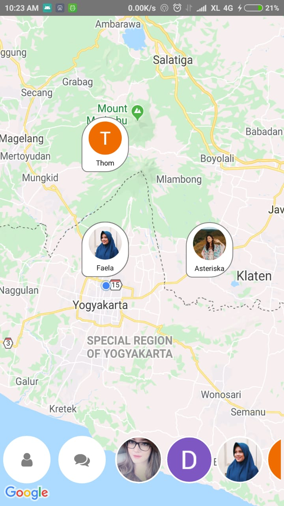
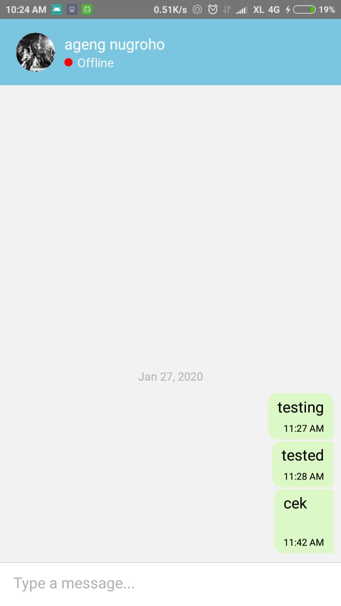
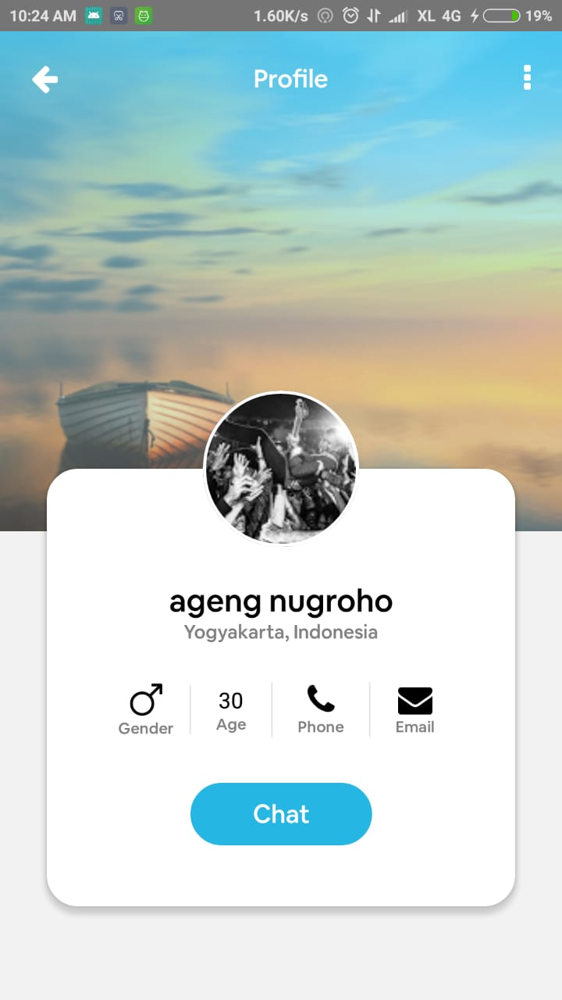
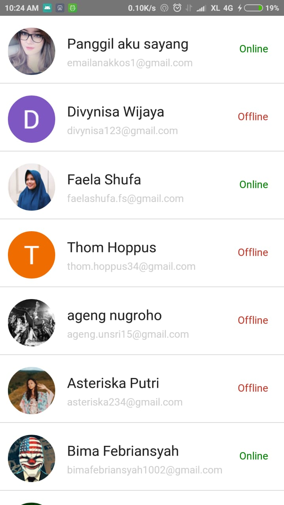
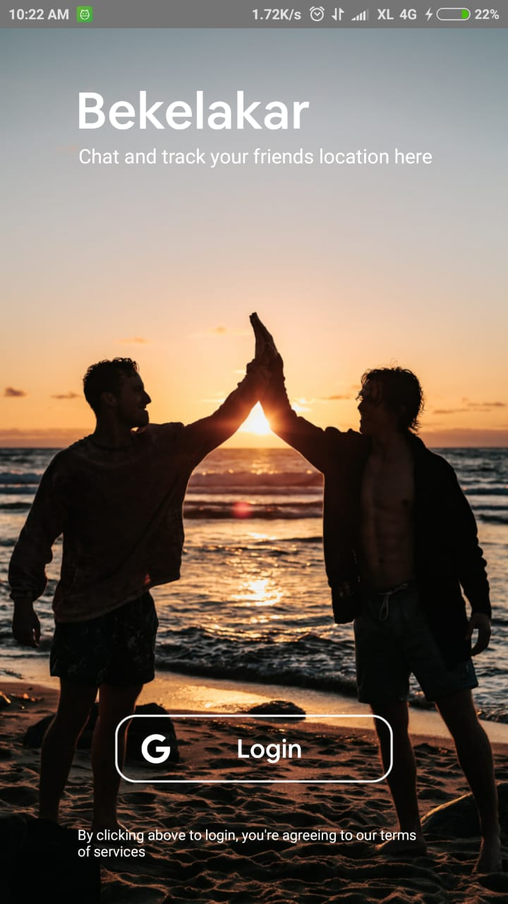
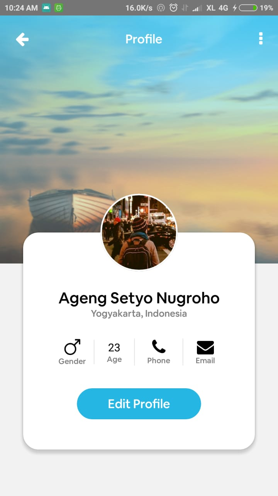

<h1 align="left">Bekelakar!</h1>

    

  Built with <b>React Native</b> and integrated with <b>Firebase</b>.

## Table of Contents

- [Introduction](#introduction)
- [Features](#features)
- [Requirements](#requirements)
- [Usage](#usage-for-development)
- [Screenshots](#screenshots)
- [Release APK](#release-apk)
- [Contributors](#contributors)

## Introduction
<b>Bekelakar!</b> is a chatting app where we can chat with friend by just add her email, we can manage our profile and see friend profile.

## Features
* User can Sign In with Google Account
* User can manage theri profile
* User can see another user profile
* User can chat with other user
* user can track other user location

## Requirements
* [`npm`](https://www.npmjs.com/get-npm)
* [`react-native`](https://facebook.github.io/react-native/docs/getting-started)
* [`react-native-cli`](https://facebook.github.io/react-native/docs/getting-started)
* [`Bekelakar`](https://github.com/melankolia/Bekelakar-Live-Tracking-Chat-)

## Screenshots

    
    
    
    
    
    

## Release APK

## Contributors

  <table>
    <tr>
      <td align="center">
        <a href="https://github.com/melankolia">
          <b>Ageng Setyo Nugroho</b>
        </a>
      </td>
    </tr>
  </table>

